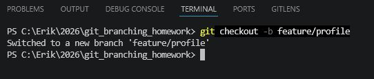
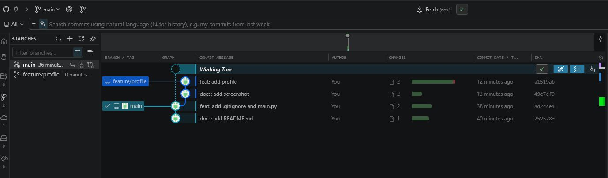
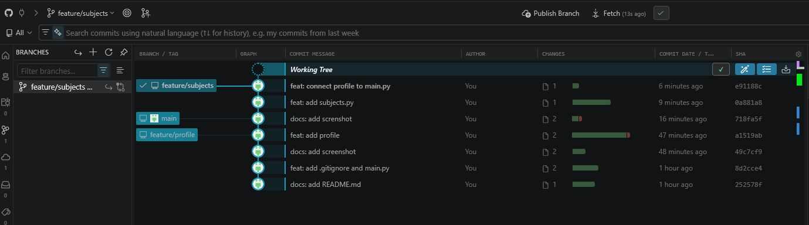
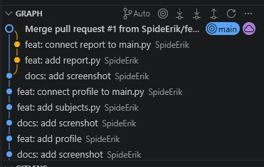
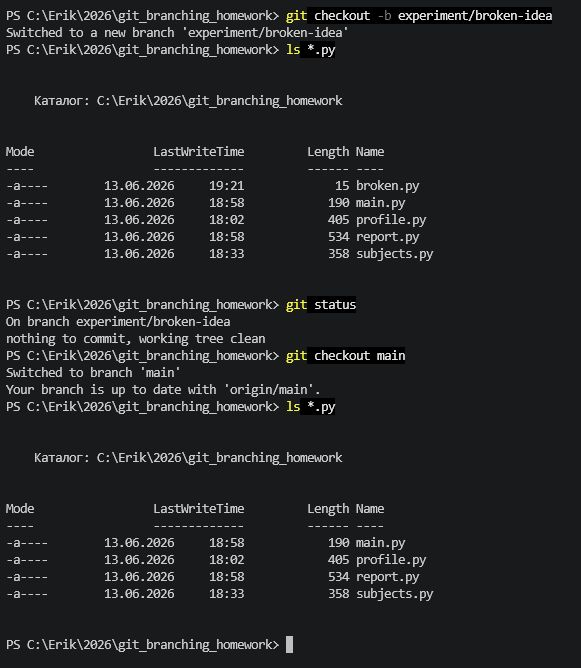
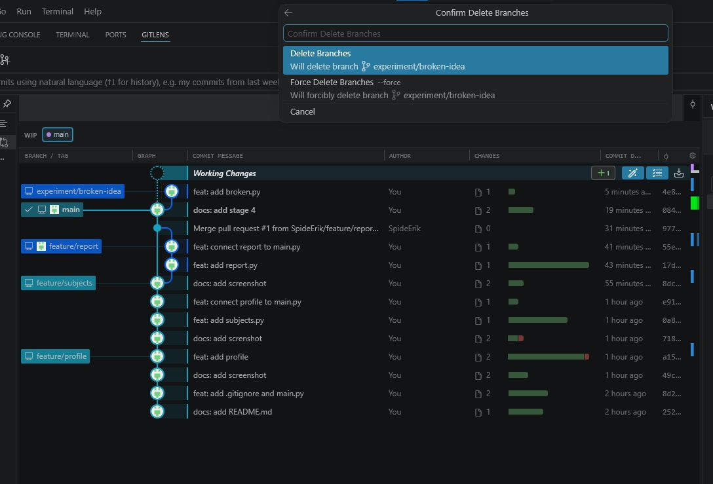

# Домашнее задание
# Git: ветки, слияние и Pull Request

## Описание проекта
Тренировка создания веток, локальное слияние и PR
Код выводит на печать информацию обо мне, изученные дисциплины и отчет.

## Использованные ветки
| Ветка | Что делал | Как попала в main |
|---|---|---|
| feature/profile | модуль профиля | merge локально |
| feature/subjects | список дисциплин | merge локально |
| feature/report | итоговый отчёт | Pull Request |
| experiment/broken-idea | тестовая идея | удалена без merge |

## Pull request
Сcылка на PR [https://github.com/SpideErik/git_branching_homework/pull/1](https://github.com/SpideErik/git_branching_homework/pull/1)

# Этапы

## Этап 1.
Создание и публикация main

## Этап 2. Ветка feature/profile: первая функция
7. Создал и перешел на ветку feature/profile

12. Скриншот Gitlens после переключения на main

## Этап 3. Ветка feature/subjects: независимая разработка
20. Скриншот GitLens (до слияния)

## Этап 4. Ветка feature/report: Pull Request на GitHub
29. Ссылка на pull request https://github.com/SpideErik/git_branching_homework/pull/1
32. Скриншот graph после синхронизации изменений с github

## Этап 5. Ветка experiment/broken-idea: удаление ненужной ветки
36. Проверка, что изменения и файлы исчезают и переключение веток

37. Для удаления ветки если она не была слита надо использовать force иначе будет ошибка удаления

# Вывод
Ветки необходимы и для совместной работы и для тестирования новых возможностей и для исправления ошибок.
Благодаря веткам в main можно всегда держать работоспособную версию.
PR позволяет другим участникам просмотреть код перед слиянием и сделать слияние в ветку main безлпаснее.
